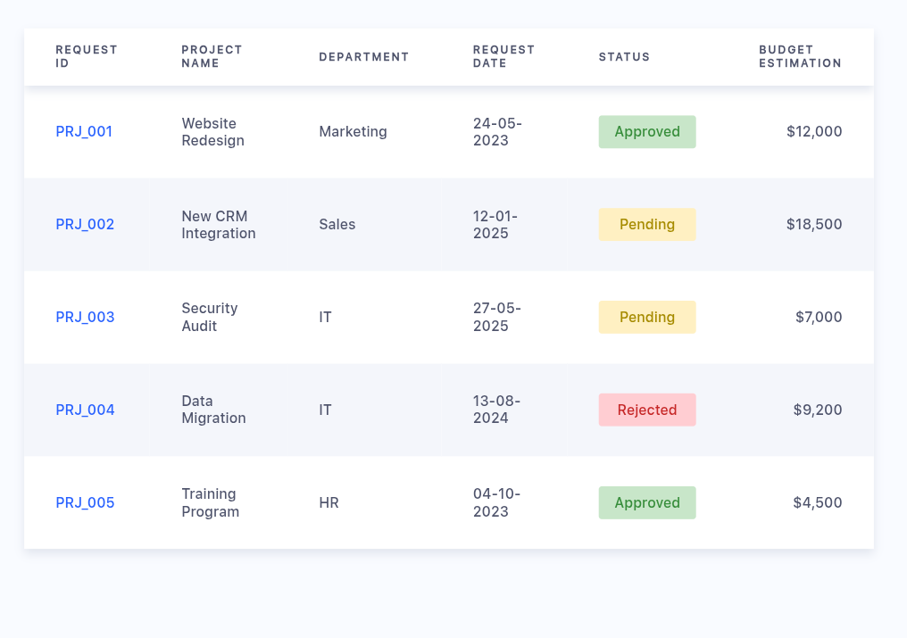

# 📊 Responsive Project Submission Table

This is a simple responsive HTML project that displays a table of project submissions. Each project contains key information such as:

- Request ID
- Project Name
- Department
- Request Date
- Status (`Approved`, `Pending`, `Rejected`)
- Estimated Budget

The table is styled with custom CSS and is optimized for desktop and mobile viewing.

---
🔗 [View Live Calculator](https://taufiqlhm2u.github.io/project-submission/)

---
## 💻 Demo



> Try resizing your browser or open the file on a mobile device to see responsive behavior.

---

## 📁 File Structure

```bash
project-submission-table/
│
├── index.html     # Main HTML file
├── style.css      # styling
└── README.md        # Project documentation (this file)
 